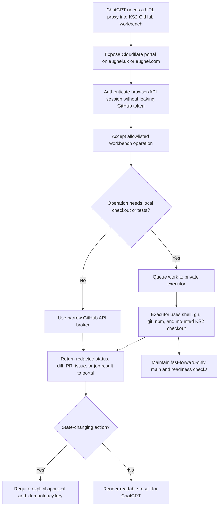

# feat: Establish KS2 GitHub Workbench

## Summary

Establish a URL-first KS2 GitHub workbench proxy that ChatGPT can reach, backed by a network-enabled shell checkout with GitHub CLI access, narrow short-lived authentication, and explicit safety boundaries. The public interface is a small Cloudflare-protected portal; the shell/workbench is the private executor behind that URL.

---

## Problem Frame

The current assistant environment can browse and render GitHub/raw files, but prior direct shell clone attempts failed. A remote VM or hidden agent workspace is not enough: the assistant needs a reachable shell checkout, a mounted repo, or a narrow GitHub bridge it can actually call.

The user clarified that the goal is not only to host a repository checkout; it is to expose a URL that ChatGPT can use as a proxy into a GitHub-capable workbench. That makes the portal the primary interface, provided it behaves as a constrained broker and not as an exposed shell.

This plan converts the existing shareable workbench brief into an implementation-ready establishment contract for `fol2/ks2-mastery`, preserving the safety posture and the acceptance checks from the origin document while making a Cloudflare portal under `eugnel.uk` or `eugnel.com` the ChatGPT-facing entry point.

---

## Assumptions

*This plan was authored without a separate interactive synthesis confirmation. The items below are agent inferences that should be reviewed before implementation proceeds.*

- The establishing agent controls a Unix-like shell where `/mnt/data/work` is a valid or creatable work root.
- The first implementation target is a Cloudflare URL that ChatGPT can reach, backed by a network-enabled shell with `gh` and a scoped token.
- Workbench setup should be treated as infrastructure establishment; product code changes in `fol2/ks2-mastery` happen only after the workbench is proven usable.
- A reversible branch/PR smoke test remains approval-gated, even when the token appears to have write permission.
- `eugnel.uk` or `eugnel.com` can be used as a Cloudflare-managed zone for the portal, but the final hostname and access policy are implementation-time choices.
- The ChatGPT caller may be better at opening URLs and submitting web forms than sending custom HTTP headers, so the portal should support a browser-usable session flow in addition to any service-token API path.

---

## Requirements

- R1. Provide a URL that ChatGPT can access as the primary proxy into the KS2 workbench.
- R1a. Back the URL with a workbench this assistant can directly operate through at least one usable route: network-enabled shell, mounted checkout, or narrow GitHub bridge.
- R2. Establish the target workspace contract for `fol2/ks2-mastery`, including `KS2_REPO`, `KS2_REPO_DIR`, non-interactive Git, and disabled GitHub CLI update prompts.
- R3. Expose the required toolchain: `git`, `curl`, `jq`, `gh`, `node`, `npm`, `rg`, and `python3`.
- R4. Provide outbound HTTPS/DNS to the GitHub domains needed for clone, raw file access, API calls, GitHub-generated archive downloads, and Git object downloads.
- R5. Use GitHub's Meta API for changing service IP/domain information rather than hardcoding stale network allowlist values.
- R6. Prefer a GitHub App installation token scoped to `fol2/ks2-mastery`; otherwise use a short-lived fine-grained PAT with minimal repository permissions.
- R7. Expose credentials only through `GH_TOKEN` or `GITHUB_TOKEN`; never embed tokens in remotes, repository files, logs, or command history.
- R8. Preserve explicit permission tiers from read-only through workflow-edit capability, with merge/deploy/admin capability disabled by default.
- R9. Prove clone and refresh through a clean `main` checkout with fast-forward-only pull policy.
- R10. Prove GitHub read/write readiness through `gh` and API checks, classifying the workbench as read-only, write-ready, or blocked.
- R11. Allow a reversible branch and PR smoke test only after user approval, then close the PR and delete the branch afterwards.
- R12. Enforce operating rules: no direct pushes to `main`, no merge by default, no force-push to shared branches, no repo settings/secrets/billing/deployment changes, and no workflow edits unless explicitly requested.
- R13. Preserve the normal KS2 code-work path once ready: fresh `main`, task branch, local verification, push branch, open PR, and fork fallback when upstream branch push is denied.
- R14. Provide a practical fallback when shell networking is impossible: a read-only Git bundle or a narrow GitHub connector/bridge with no merge/admin endpoints.
- R15. Expose the small portal under a Cloudflare-managed `eugnel.uk` or `eugnel.com` hostname as the primary ChatGPT-facing interface.
- R16. The portal must be a narrow broker for allowlisted GitHub/workbench operations, not a generic shell, arbitrary command runner, arbitrary web proxy, or broad GitHub proxy.
- R17. Protect the portal with Cloudflare Access/service-token controls or equivalent authentication, and validate Access tokens at the origin when required by the chosen topology.
- R18. Store portal secrets only in Cloudflare Worker secrets or the private executor environment; never ship GitHub tokens to browser clients or unauthenticated callers.
- R19. Require audit logging, idempotency keys for writes, request redaction, and explicit user approval for state-changing actions.
- R20. Distinguish API-only portal capabilities from executor-backed capabilities: GitHub API writes can run at the edge, but local `git`, `npm test`, and `npm run check` need the actual workbench executor.
- R21. Provide a browser-usable session or signed-link flow so ChatGPT can operate through the portal URL even when it cannot attach Cloudflare service-token headers.
- R22. The portal must expose machine-readable and human-readable views for status, issues, PRs, diffs, proposed writes, approval state, and job results.

---

## Scope Boundaries

- This plan does not create, print, store, or rotate real GitHub credentials.
- This plan does not grant merge, deployment, billing, repository administration, branch protection, settings, or secrets access by default.
- This plan does not implement product changes in `fol2/ks2-mastery`.
- This plan does not rely on a remote VM, Codespace, or workspace that is unreachable from the assistant session.
- This plan does not bypass network policy with static copied IPs; dynamic service data must come from GitHub's Meta API.
- This plan does not require a write smoke test unless the user explicitly approves it.
- This plan does not expose a public unauthenticated portal.
- This plan does not expose arbitrary shell execution, arbitrary filesystem reads, or generic outbound HTTP proxying through the portal.
- This plan does not make the portal a general-purpose proxy to any URL or repository; it is scoped to the KS2 workbench contract.
- This plan does not place GitHub or Cloudflare secrets in browser-visible JavaScript, local storage, query strings, or portal responses.

### Deferred to Follow-Up Work

- Persistent token broker or GitHub App automation: separate security-reviewed follow-up if repeated short-lived token issuance becomes necessary.
- CI-specific or workflow-file changes: separate task only when the user explicitly asks for workflow work.
- Deployment or merge automation: separate task with explicit authority and audit requirements.
- Rich web UI beyond the smallest usable portal: separate follow-up after the broker contract and security model are proven.

---

## Context & Research

### Relevant Code and Patterns

- `docs/plan/ks2-github-workbench-establishment-plan.md` is the origin artifact and source of truth for the target path, environment contract, permission tiers, bootstrap expectations, acceptance checks, safety rules, and fallback connector shape.
- This repository currently contains planning documentation only; there is no local application code or existing test framework to extend.
- Prior KS2 work used `npm test` and `npm run check` as meaningful local verification gates, and `npm run check` has previously covered build, public asset assertion, client audit, and Wrangler dry-run deploy behaviour.
- Prior KS2 work also showed that `gh pr merge --delete-branch` can fail locally because another worktree already has `main` checked out, even when the GitHub merge itself has succeeded. Readiness and merge checks should therefore verify remote state directly.
- The KS2 project has Cloudflare Worker deployment context, so workflow/build/deploy changes must stay out of the default workbench scope.
- Cloudflare can host the portal front door on a custom domain or route within a managed zone; that makes `eugnel.uk` or `eugnel.com` the intended public entry point if DNS and Access policy are configured.
- A Worker-only portal can mediate GitHub API operations, but it cannot run local Git/npm verification. Full workbench behaviour needs a private executor behind the portal, for example through Cloudflare Tunnel or an outbound polling queue.

### Institutional Learnings

- Treat branch/PR build suppression and deployment settings as live operational state, not a label in a config file.
- Compare PR and base check runs before blaming a branch for a red Cloudflare Workers build; some failures can pre-exist on `origin/main`.
- If a validation tool flakes, use deterministic GitHub/API checks to classify the workbench instead of stopping at the first tool failure.

### External References

- GitHub restricted-network guidance supports domain exceptions for GitHub services and links to REST metadata for current service data: https://docs.github.com/en/get-started/using-github/allowing-access-to-githubs-services-from-a-restricted-network
- GitHub REST Meta API returns current GitHub service IP/domain metadata and says the latest values should be queried directly: https://docs.github.com/en/rest/meta/meta?apiVersion=2022-11-28#get-github-meta-information
- GitHub App installation tokens can be constrained by repositories and permissions, and installation access tokens expire after one hour: https://docs.github.com/en/apps/creating-github-apps/authenticating-with-a-github-app/generating-an-installation-access-token-for-a-github-app
- Fine-grained PATs support repository permissions such as contents, issues, pull requests, metadata, and workflows at explicit access levels: https://docs.github.com/en/authentication/keeping-your-account-and-data-secure/managing-your-personal-access-tokens
- GitHub CLI uses `GH_TOKEN` and `GITHUB_TOKEN` for headless authentication against `github.com`, avoiding interactive prompts: https://cli.github.com/manual/gh_help_environment
- Git documents `pull --ff-only` as failing when local history has diverged, which protects a clean assistant-controlled `main`: https://git-scm.com/docs/git-pull
- Cloudflare Workers support custom domains and routes for Internet-facing HTTP entry points: https://developers.cloudflare.com/workers/configuration/routing/
- Cloudflare Access service tokens can authenticate automated systems to protected applications: https://developers.cloudflare.com/cloudflare-one/access-controls/service-credentials/service-tokens/
- Cloudflare Access application tokens must be validated by the origin unless the application is connected through Access via Cloudflare Tunnel: https://developers.cloudflare.com/cloudflare-one/access-controls/applications/http-apps/authorization-cookie/application-token/
- Cloudflare Workers secrets are intended for API keys and tokens used by Worker code: https://developers.cloudflare.com/workers/configuration/secrets/
- Cloudflare Tunnel uses outbound-only connections from the private origin to Cloudflare, which can expose a private workbench service without opening inbound ports: https://developers.cloudflare.com/cloudflare-one/networks/connectors/cloudflare-tunnel/

---

## Key Technical Decisions

- Use the Cloudflare portal URL as the primary ChatGPT interface: the shell plus `gh` is still essential, but it serves as the executor behind the URL.
- Keep authentication external to Git remotes and files: `GH_TOKEN` or `GITHUB_TOKEN` gives `gh` and API calls non-interactive access without leaking credentials into repo config.
- Treat permission as a tiered capability, not a binary authenticated/unauthenticated state: the workbench should report read-only, triage-ready, branch/PR-ready, workflow-edit-ready, or admin-disabled status.
- Configure `main` with fast-forward-only pulls: a diverged local `main` should fail loudly rather than silently merging or rebasing in an assistant-controlled workspace.
- Make smoke testing reversible and explicit: branch push and PR creation prove write readiness, but only after the user approves the action and with required cleanup afterwards.
- Prefer fork fallback over escalating upstream permissions: if upstream branch push fails, use a user fork while still opening PRs against `fol2/ks2-mastery`.
- Make the Cloudflare portal a constrained bridge into the workbench: it should expose status, read, diff, branch, commit proposal, PR, issue, and review operations, not raw shell access.
- Support both browser-usable and API-usable interaction: HTML/forms help ChatGPT operate through normal browsing, while JSON endpoints help environments that can send authenticated requests.
- Prefer a private executor behind the portal for full workbench capability: a Worker-only broker is useful for GitHub API tasks, but local verification and real checkout operations require the `/mnt/data/work/ks2-mastery` executor.
- Keep connector fallback narrow: if shell networking is impossible, the bridge should expose read, branch, commit, PR, issue, and review operations only, with no default merge/admin/secrets/settings capability.

---

## Alternative Approaches Considered

- Direct shell only: simplest executor model, but rejected as the full solution because ChatGPT needs a URL-facing proxy.
- Worker-only GitHub API portal: fastest way to give ChatGPT a callable endpoint on `eugnel.uk` or `eugnel.com`, but incomplete because it cannot run local tests, inspect an actual checkout, or use repo-native scripts.
- Worker front door plus private executor: chosen direction because Cloudflare handles the public protected URL while the executor keeps the real checkout, `gh`, `git`, and Node verification in a controlled environment.
- Public unprotected portal: rejected because it would expose repository write capability and likely token-bearing workflows to the Internet.

---

## Open Questions

### Resolved During Planning

- Which workbench route should be attempted first? Expose the Cloudflare portal URL as the ChatGPT-facing proxy, backed by a network-enabled shell plus `gh` and a scoped token.
- Which repository is in scope? Only `fol2/ks2-mastery`.
- Should tokens be embedded in the Git remote URL? No; expose them only as `GH_TOKEN` or `GITHUB_TOKEN`.
- Should `main` allow merge/rebase updates? No; use fast-forward-only refresh.
- Should merge or deployment capability be enabled by default? No; keep Tier 4 disabled unless the user explicitly approves a named action.

### Deferred to Implementation

- Exact package installation method: depends on the establishing environment's base image and package manager.
- Exact token issuer: depends on whether a GitHub App installation token is available or a short-lived fine-grained PAT must be used.
- Exact permission visible from `viewerPermission`: must be observed from the live token and reported.
- Exact smoke branch date suffix: choose at runtime using the actual establishment date.
- Whether dependency installation is required before KS2 tests can run: determine after the checkout exists.
- Which hostname to use for the portal: choose during implementation after checking existing Cloudflare DNS/routes for `eugnel.uk` and `eugnel.com`.
- Whether ChatGPT will call the portal with browser-mediated signed-session URLs, service-token headers, Cloudflare Access login, or a user-approved session: decide based on the actual ChatGPT/tooling access path.
- Whether the portal executes writes directly through GitHub API or queues them for the private executor: decide by required capability for the first real task.

---

## High-Level Technical Design

> *This illustrates the intended approach and is directional guidance for review, not implementation specification. The implementing agent should treat it as context, not code to reproduce.*

---

## Implementation Units

- U1. **Provision Reachable Runtime Contract**

**Goal:** Ensure the assistant has a concrete operating surface rather than an unreachable remote workspace.

**Requirements:** R1, R2, R3

**Dependencies:** None

**Files:**
- Reference: `docs/plan/ks2-github-workbench-establishment-plan.md`
- Create: none in this repository
- Test: none in this repository; verification is through environment probes

**Approach:**
- Establish `/mnt/data/work/ks2-mastery` as the runtime checkout location because it is explicitly named in the origin brief.
- Export the repo and GitHub CLI environment contract for every assistant shell session.
- Install or expose the required tools, treating `gh`, `rg`, and `python3` as first-class dependencies rather than optional conveniences for practical agent work.
- Fail early with a clear missing-tool report rather than partially bootstrapping an unusable workbench.

**Patterns to follow:**
- Use the origin brief's "Non-negotiable access contract" to decide whether the workspace is genuinely usable.

**Test scenarios:**
- Happy path: all required tools are present, each reports a version, and the workbench continues to network/auth checks.
- Error path: a required tool is missing, and the readiness report marks the workbench blocked before clone or auth attempts.
- Edge case: `gh` is missing but GitHub read-only clone works; classify as read-only/local-patch capable unless a REST bridge is also provided.

**Verification:**
- The assistant can run commands in the target shell and can see the intended KS2 work root.
- The readiness report lists every required tool as present or missing.

---

- U2. **Establish Network Allowlist and Metadata Checks**

**Goal:** Prove the shell can reach GitHub services needed for clone, API, raw content, archive downloads, and Git object downloads.

**Requirements:** R4, R5

**Dependencies:** U1

**Files:**
- Reference: `docs/plan/ks2-github-workbench-establishment-plan.md`
- Create: none in this repository
- Test: none in this repository; verification is through network probes

**Approach:**
- Validate outbound HTTPS/DNS to the required GitHub domains from the origin brief.
- Use GitHub's Meta API as the source for current service metadata when restricted-network allowlists need current IP/domain data.
- Report proxy configuration needs separately from GitHub service failures, so network policy problems are not mistaken for repository access problems.

**Patterns to follow:**
- Use current official GitHub metadata, not copied static IPs.

**Test scenarios:**
- Happy path: GitHub web, API, raw, codeload, and object endpoints are reachable and metadata can be retrieved.
- Error path: DNS or HTTPS fails for one required endpoint, and the report names the failing endpoint and blocked capability.
- Edge case: public API metadata works but Git remote access fails; classify clone capability separately from API capability.

**Verification:**
- The workbench can query GitHub service metadata live.
- The workbench can verify that `fol2/ks2-mastery` has a reachable remote `HEAD`.

---

- U3. **Install Scoped Authentication and Permission Classification**

**Goal:** Make GitHub authentication non-interactive, minimally scoped, and observable without leaking secrets.

**Requirements:** R6, R7, R8, R10

**Dependencies:** U1, U2

**Files:**
- Reference: `docs/plan/ks2-github-workbench-establishment-plan.md`
- Create: none in this repository
- Test: none in this repository; verification is through authenticated GitHub CLI/API checks

**Approach:**
- Prefer a GitHub App installation token scoped to `fol2/ks2-mastery` with only the requested permission tier.
- Use a short-lived fine-grained PAT only when the App token route is unavailable.
- Expose the token through `GH_TOKEN` or `GITHUB_TOKEN`, and confirm Git remotes do not contain credentials.
- Classify capability by observed access: read-only, issue/PR triage, branch/PR creation, workflow-edit readiness, or Tier 4 disabled.

**Patterns to follow:**
- Keep token handling compatible with `gh` headless authentication.
- Treat "authenticated" as insufficient until repository-level permission is observed.

**Test scenarios:**
- Happy path: a Tier 2 token shows repository access, can read issues/PRs, and is classified as branch/PR-ready.
- Edge case: no token is present but public clone works; classify as read-only with local patch capability.
- Error path: token is present but lacks repo access; classify as blocked for authenticated actions while preserving any unauthenticated read capability.
- Security path: remote URLs and readiness output do not contain token material.

**Verification:**
- GitHub CLI and API checks report repository identity, default branch, and viewer permission without prompting.
- The readiness report includes the effective permission tier and denied capabilities.

---

- U4. **Clone and Refresh KS2 Checkout Safely**

**Goal:** Create or refresh a clean `main` checkout of `fol2/ks2-mastery` under the target work root.

**Requirements:** R2, R9, R13

**Dependencies:** U1, U2

**Files:**
- Reference: `docs/plan/ks2-github-workbench-establishment-plan.md`
- Create: none in this repository
- Test: none in this repository; verification is through Git state checks

**Approach:**
- Clone `main` into the target KS2 repo directory when no checkout exists.
- If a checkout already exists, normalise the `origin` remote to the public GitHub URL and refresh `main` without creating merge commits.
- Configure fast-forward-only pulls and fetch pruning for the assistant-controlled checkout.
- Preserve local branch work by keeping task branches separate from `main`.

**Patterns to follow:**
- Prior KS2 work showed multi-worktree state can complicate local cleanup, so remote state must be verified directly when local branch operations report conflicts.

**Test scenarios:**
- Happy path: a fresh target work root receives a `main` checkout and reports a clean branch state.
- Happy path: an existing checkout refreshes `main` without changing task branches.
- Error path: local `main` has diverged from origin; refresh fails and the report instructs manual resolution rather than merging.
- Edge case: checkout exists but `origin` points to a token-bearing or wrong remote URL; remote is corrected without printing credentials.

**Verification:**
- The checkout reports a clean `main` branch and a concrete commit SHA.
- Local `main` and remote `HEAD` can be compared as part of the readiness report.

---

- U5. **Run Readiness and Acceptance Reporting**

**Goal:** Produce a concise, evidence-backed status that tells the assistant whether it can do read-only work, write-ready work, or only fallback/local work.

**Requirements:** R10, R13, R14

**Dependencies:** U2, U3, U4

**Files:**
- Reference: `docs/plan/ks2-github-workbench-establishment-plan.md`
- Create: none in this repository
- Test: none in this repository; verification is through acceptance probes

**Approach:**
- Report Git state, remote reachability, GitHub API repo identity, `gh` repository permission, issue listing, and PR listing.
- Treat clone/pull success with failed `gh` auth as read-only plus local-patch capable, not a total failure.
- Treat failed shell networking with a mounted Git bundle as local read-only only.
- Surface exact blocked capability rather than returning a single generic failure.

**Patterns to follow:**
- Use deterministic fallbacks where tooling flakes, and keep product verification separate from environment failure.

**Test scenarios:**
- Happy path: clone, pull, API, issue list, and PR list all pass; classify the workbench according to observed write permission.
- Edge case: clone/pull passes but `gh auth status` fails; classify as read-only and list disabled issue/PR actions.
- Error path: neither clone nor GitHub API can reach the repo; classify as blocked and point to network/connector fallback.
- Integration path: KS2 local verification commands are available after dependencies are installed, but absence of dependencies does not invalidate the workbench itself.

**Verification:**
- The final report includes workspace path, repo name, current commit, remote `HEAD`, observed permission, and allowed/disallowed actions.

---

- U6. **Gate and Clean Up Reversible Write Smoke**

**Goal:** Prove branch push and PR creation only after user approval, then leave no lingering smoke PR or branch.

**Requirements:** R11, R12, R13

**Dependencies:** U3, U4, U5

**Files:**
- Reference: `docs/plan/ks2-github-workbench-establishment-plan.md`
- Runtime-only smoke artefact: `.agent-smoke/workbench-smoke.txt` on the temporary branch
- Test: none in this repository; verification is through branch/PR lifecycle checks

**Approach:**
- Ask for explicit approval before creating any branch, commit, push, or PR.
- Create a temporary branch from fresh `main` and add only a harmless smoke artefact.
- Prefer upstream branch push when permitted; otherwise use fork fallback.
- Close the smoke PR and delete the smoke branch after the write path is proven.
- Never merge the smoke PR.

**Patterns to follow:**
- Use branch and PR operations as a reversible capability test, not as product work.

**Test scenarios:**
- Happy path: approved smoke creates a branch and PR, confirms the PR URL, then closes the PR and deletes the branch.
- Edge case: upstream push is denied but fork push is allowed; PR opens from fork and capability is reported as fork-write-ready.
- Error path: PR creation succeeds but cleanup fails; report the exact PR/branch identifiers requiring manual cleanup.
- Security path: smoke artefact contains no secrets, token material, or product changes.

**Verification:**
- A write-ready report includes evidence of the temporary PR and evidence that it was closed and the branch removed.

---

- U7. **Provide Fallback Bundle or Narrow Bridge**

**Goal:** Preserve useful read-only or mediated GitHub work when direct shell networking cannot be enabled.

**Requirements:** R1, R14

**Dependencies:** U1, U2

**Files:**
- Reference: `docs/plan/ks2-github-workbench-establishment-plan.md`
- Create: none in this repository
- Test: none in this repository; verification is through fallback capability checks

**Approach:**
- Use a Git bundle when the immediate need is local read/search/patch work without live GitHub interaction.
- Use a narrow connector only when live issue/PR/branch/review operations are needed but shell networking is blocked.
- Keep bridge operations scoped to `fol2/ks2-mastery`, log write calls, require idempotency keys for writes, and omit merge/admin/secrets/settings endpoints by default.

**Patterns to follow:**
- A remote system is useful only when the assistant can operate it through a mounted checkout or callable bridge.

**Test scenarios:**
- Happy path: bundle clone produces a readable local checkout and reports local-only capability.
- Happy path: bridge can read repo files, create a branch, commit files, open a PR, and review a PR within the scoped repository.
- Error path: bridge exposes merge/admin/settings/secrets operations by default; reject the bridge as over-scoped.
- Edge case: bridge read works but write calls lack idempotency keys or audit identifiers; classify as read-only until write controls are fixed.

**Verification:**
- The fallback report states exactly which operations are available and which are impossible without shell network or a stronger connector.

---

- U8. **Expose Secure ChatGPT Portal URL**

**Goal:** Give ChatGPT a callable, protected URL that acts as the primary proxy into the KS2 GitHub workbench.

**Requirements:** R1, R15, R16, R17, R18, R21, R22

**Dependencies:** U1, U2, U3

**Files:**
- Reference: `docs/plan/ks2-github-workbench-establishment-plan.md`
- Create: none in this repository
- Test: none in this repository; verification is through portal access and auth probes

**Approach:**
- Choose a dedicated hostname under `eugnel.uk` or `eugnel.com`, such as a workbench-specific subdomain, after checking existing Cloudflare routes.
- Put Cloudflare Worker or Cloudflare Access in front of the portal, using a custom domain or route rather than relying on an unmanaged endpoint.
- Protect automated access with Cloudflare Access service-token headers or an equivalent single-header service-auth policy when the caller cannot complete browser login.
- Also support a short-lived signed-session URL or browser-usable approval flow so ChatGPT can operate through the portal when it cannot attach custom service-token headers.
- If the portal forwards to a private origin, validate Cloudflare Access application tokens at the origin unless the selected Cloudflare Tunnel topology already provides the required Access enforcement.
- Keep portal responses redacted and capability-scoped so a status page cannot leak tokens, environment variables, filesystem paths beyond the workbench contract, or private branch data unrelated to `fol2/ks2-mastery`.

**Patterns to follow:**
- Use Cloudflare as the controlled edge boundary, but keep GitHub authority minimal and repo-scoped.

**Test scenarios:**
- Happy path: ChatGPT opens the portal URL with a valid session and sees repo, capability, and readiness metadata.
- Happy path: the same status is available as structured data for clients that can consume JSON.
- Error path: an unauthenticated caller receives no workbench status and no token-bearing error detail.
- Edge case: service-token auth works for automated clients that can send headers, while browser login remains available only if intentionally enabled.
- Edge case: a signed session expires and denies further write proposals without invalidating already audited read results.
- Security path: portal source, deployment config, and responses do not expose GitHub tokens, Cloudflare secrets, or executor environment variables.

**Verification:**
- The selected hostname resolves through Cloudflare and reaches the portal only through the configured access policy.
- ChatGPT can use the URL to request at least one scoped read operation without opening arbitrary shell access.

---

- U9. **Define Broker API and Private Executor Contract**

**Goal:** Convert the portal URL from a page into a safe proxy that can perform useful GitHub/workbench actions without becoming an unrestricted remote control surface.

**Requirements:** R16, R19, R20, R21, R22

**Dependencies:** U3, U4, U5, U8

**Files:**
- Reference: `docs/plan/ks2-github-workbench-establishment-plan.md`
- Create: none in this repository
- Test: none in this repository; verification is through broker contract probes

**Approach:**
- Start with a small broker surface exposed through both HTML and JSON where useful: status, repo metadata, branch list, issue list, PR list, PR diff, file read, staged commit proposal, PR creation request, and review-comment request.
- Separate "propose" from "execute" for writes. The portal should support human-readable pending actions and require explicit approval before commits, pushes, PR creation, reviews, or smoke-test cleanup.
- Require idempotency keys for every write so retries cannot create duplicate branches, commits, PRs, or comments.
- Route API-only actions through the Worker when no local checkout is needed, but route checkout, diff, test, and `gh` operations to the private executor.
- Keep the executor outbound-only where possible, either by having it poll for queued work or by exposing it through Cloudflare Tunnel with Access protection.
- Record audit entries with actor, requested operation, repository, branch, idempotency key, result, and created GitHub URLs/IDs.

**Patterns to follow:**
- The origin brief's minimal connector API is the upper bound for the first broker; do not add merge/admin/settings/secrets endpoints.

**Test scenarios:**
- Happy path: ChatGPT can navigate from status to issues/PRs/diff views through URLs and receive scoped KS2 data without requiring write capability.
- Happy path: structured JSON endpoints return equivalent status for clients that can use API calls.
- Happy path: an approved PR creation request produces exactly one branch and one PR even if the request is retried with the same idempotency key.
- Error path: an unapproved write request is recorded as pending or rejected and does not touch GitHub.
- Error path: a requested operation outside the allowlist, such as arbitrary shell execution or repository settings access, is denied and audited.
- Integration path: a local verification request runs only on the private executor, not inside the Worker-only edge path.

**Verification:**
- The portal URL can prove at least one read-only GitHub operation and one approval-gated no-op/dry-run write flow without exposing generic shell access.
- Broker logs can reconstruct what was requested, approved, executed, and cleaned up.

---

## System-Wide Impact

- **Interaction graph:** The Cloudflare portal URL is the ChatGPT-facing interface. Behind it sit the broker, GitHub network/API, the private executor, the `fol2/ks2-mastery` checkout, GitHub CLI, and optional fallback bridge or bundle.
- **Error propagation:** Missing tools, blocked network, invalid token, insufficient permission, diverged `main`, and cleanup failures should each produce distinct readiness outcomes.
- **State lifecycle risks:** Temporary smoke branches and PRs must be cleaned up; `main` must remain clean and fast-forward-only; tokens must not persist in remotes, repository files, portal responses, browser storage, or audit logs.
- **API surface parity:** Shell, `gh`, REST API, and fallback bridge should report equivalent repo identity and permission information where available.
- **Integration coverage:** Clone/pull checks alone do not prove the ChatGPT proxy path; portal URL access, auth/session checks, read views, broker contract probes, `gh` issue/PR checks, and an approval-gated smoke branch/PR are needed for the full path.
- **Unchanged invariants:** No direct pushes to `main`, no default merge capability, no public unauthenticated portal, no arbitrary shell endpoint, no secrets/settings/admin/deployment changes, and no workflow edits outside explicit CI/workflow tasks.

---

## Risks & Dependencies

| Risk | Mitigation |
|------|------------|
| Token is too broad or long-lived | Prefer GitHub App installation tokens, otherwise short-lived fine-grained PATs scoped only to `fol2/ks2-mastery`; classify permission tiers explicitly. |
| Token leaks through logs or remotes | Use `GH_TOKEN` or `GITHUB_TOKEN` only; verify remote URLs and reports do not include credentials. |
| Network allowlist drifts | Query GitHub's Meta API for current service data instead of hardcoding stale IPs. |
| Local `main` diverges | Configure fast-forward-only pulls and fail refresh rather than merging or rebasing. |
| Write smoke leaves clutter | Use a clearly named temporary branch/PR and require cleanup evidence. |
| `gh` auth fails but clone works | Classify as read-only instead of discarding useful local work capability. |
| Upstream branch push is denied | Use fork fallback and open PR from fork. |
| Bridge fallback is over-scoped | Reject default merge/admin/settings/secrets endpoints and require scoped, logged, idempotent operations. |
| KS2 verification is misread as workbench failure | Separate environment readiness from product test dependency state; dependency installation can be a later checkout concern. |
| Portal exposes too much authority | Keep the portal allowlisted, Access-protected, approval-gated for writes, and free of arbitrary shell execution. |
| ChatGPT cannot send Cloudflare Access headers | Decide whether to use browser-mediated Access, a single-header service-token mode, or a user-approved session before relying on portal automation. |
| Worker-only portal is mistaken for full workbench | Report Worker-only capability separately from executor-backed checkout/test capability. |
| Origin token spoofing risk | Validate Cloudflare Access application tokens at the origin when the topology requires origin validation. |
| URL token becomes a bearer secret | Make signed portal sessions short-lived, repo-scoped, capability-scoped, revocable, and never sufficient for unapproved writes. |

---

## Documentation / Operational Notes

- The establishing agent should finish with a short readiness report: read-only, write-ready, or blocked, plus the evidence behind that classification.
- If clone/pull works but `gh` authentication does not, the assistant can still do read-only repository analysis and local patches.
- If neither shell network nor connector access exists, the Git bundle path only enables local read-only work and cannot support issue/PR interaction.
- The preferred portal shape is a Cloudflare-protected URL under `eugnel.uk` or `eugnel.com`, backed by either GitHub API calls or a private executor. This is the ChatGPT-facing interface; the shell is the executor.
- Merge, deploy, repo settings, branch protection, billing, secrets, and workflow changes require explicit future user approval.

---

## Sources & References

- **Origin document:** [docs/plan/ks2-github-workbench-establishment-plan.md](../plan/ks2-github-workbench-establishment-plan.md)
- GitHub restricted-network guidance: https://docs.github.com/en/get-started/using-github/allowing-access-to-githubs-services-from-a-restricted-network
- GitHub REST Meta API: https://docs.github.com/en/rest/meta/meta?apiVersion=2022-11-28#get-github-meta-information
- GitHub App installation access tokens: https://docs.github.com/en/apps/creating-github-apps/authenticating-with-a-github-app/generating-an-installation-access-token-for-a-github-app
- GitHub fine-grained PAT permissions: https://docs.github.com/en/authentication/keeping-your-account-and-data-secure/managing-your-personal-access-tokens
- GitHub CLI environment variables: https://cli.github.com/manual/gh_help_environment
- Git `pull --ff-only`: https://git-scm.com/docs/git-pull
- Cloudflare Workers routes and custom domains: https://developers.cloudflare.com/workers/configuration/routing/
- Cloudflare Access service tokens: https://developers.cloudflare.com/cloudflare-one/access-controls/service-credentials/service-tokens/
- Cloudflare Access application token validation: https://developers.cloudflare.com/cloudflare-one/access-controls/applications/http-apps/authorization-cookie/application-token/
- Cloudflare Workers secrets: https://developers.cloudflare.com/workers/configuration/secrets/
- Cloudflare Tunnel: https://developers.cloudflare.com/cloudflare-one/networks/connectors/cloudflare-tunnel/
