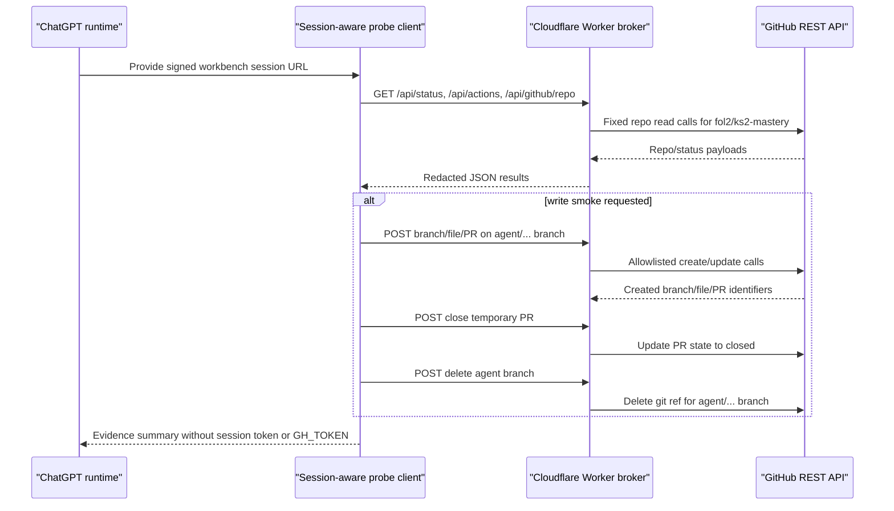

# feat: Make KS2 Broker Operable from ChatGPT Runtime

## Summary

Make the deployed KS2 GitHub workbench broker usable from a constrained ChatGPT runtime without exposing GitHub credentials. The plan adds a session-aware probe/client path, restores the test evidence artefacts into the repo, and extends the Worker with self-cleaning smoke support for temporary PRs and `agent/...` branches.

---

## Problem Frame

The Worker broker is deployed and its unauthenticated boundary behaves correctly, but the current runtime cannot operate it end-to-end: shell DNS failed for `gptpro-gh-workbench.eugnel.uk`, no signed workbench session URL is available in this chat, and no POST-capable REST connector is exposed here.

The practical blocker is therefore no longer GitHub access inside the Worker. It is the client path between ChatGPT and the broker, plus the lack of broker-owned cleanup endpoints for write smoke tests.

---

## Assumptions

*This plan was authored from the supplied test report and local repo research without a separate confirmation round. These are agent inferences that should be reviewed before implementation proceeds.*

- The next implementation slice should keep the current Worker-only broker model and should not connect a private executor yet.
- The immediate success condition is a reusable session-scoped probe that can prove read access and, when explicitly requested, a reversible write smoke.
- Cleanup endpoints are a prerequisite before `--write-smoke` becomes routine.
- The three user-named evidence artefacts should be restored or recreated in this repository because they are not present in this worktree at plan time.
- Formal pull request review submission should be deferred until the client path and cleanup lifecycle are reliable.

---

## Requirements

- R1. Provide a session-scoped client path that can call broker `GET` and `POST` endpoints without receiving or exposing `GH_TOKEN`.
- R2. Preserve the existing security boundary: unauthenticated dashboard/API requests return no workbench data, and tokens are not echoed in HTML, JSON, logs, test fixtures, or docs.
- R3. Restore the reusable probe and evidence artefacts named by the runtime test report so the next agent can reproduce the read-only and write-smoke checks.
- R4. Make the read-only probe distinguish DNS failure, missing session URL, unauthorised session, upstream GitHub failure, and successful broker responses.
- R5. Add broker cleanup endpoints that can close temporary pull requests and delete `agent/...` branches, while continuing to reject direct `main`, non-`agent/...`, workflow, merge, admin, secret, and generic Git operations.
- R6. Make live write smoke self-cleaning before it is recommended as standard practice.
- R7. Keep capability reporting accurate: `/api/status`, `/api/actions`, the dashboard, README, and test report should describe exactly what the broker can and cannot do.
- R8. Cover the new client and Worker behaviour with targeted tests, especially validation failures, secret redaction, cleanup success, and cleanup partial failure.

---

## Scope Boundaries

- This plan does not provide James's signed session URL, `WORKBENCH_SESSION_TOKEN`, or `GH_TOKEN`.
- This plan does not fix DNS or HTTPS resolution inside external ChatGPT runtimes; it makes failures diagnosable and provides a client that works once the session URL or runtime network path exists.
- This plan does not add arbitrary shell execution, local clone/pull, local tests, private executor jobs, or repo-native script execution.
- This plan does not add merge, deployment, repo settings, secrets, billing, workflow-management, or direct-main write endpoints.
- This plan does not make the broker multi-repository; `fol2/ks2-mastery` remains fixed.
- This plan does not make write-smoke automatic. It remains opt-in through an explicit flag and must clean up after itself.

### Deferred to Follow-Up Work

- Formal PR review operations: add a separate review-focused slice after cleanup is stable, because `APPROVE`, `REQUEST_CHANGES`, and inline diff comments need stronger diff-position validation and explicit user intent.
- Private executor integration: connect clone/fetch, local diffs, `npm test`, `npm run check`, and repo-native scripts behind the existing Worker front door in a later slice.
- Runtime/platform connector: expose a first-class POST-capable REST connector to ChatGPT if the hosting platform supports it.
- Session minting/rotation UI: provide a safer operator flow for short-lived signed session URLs once the basic session URL contract is proven.

---

## Context & Research

### Relevant Code and Patterns

- `src/worker.js` is a single Cloudflare Worker module with constants for the target repo, allowlisted read/write endpoints, JSON helpers, GitHub fetch helpers, branch/path/text validators, and dashboard rendering.
- `tests/worker.test.js` uses Node's built-in test runner with mocked `globalThis.fetch` to validate routing, session gating, GitHub API calls, write validation, and token redaction.
- `README.md` documents the live route, current read/write endpoints, local development commands, deployment shape, and security boundaries.
- `@/2026-04-28-gptpro-gh-workbench-deployment-report.md` records that the deployed write broker live-smoked branch/file/PR creation and manually cleaned up KS2 PR #491 plus its `agent/...` smoke branch.
- `docs/plans/2026-04-28-001-feat-ks2-github-workbench-plan.md` established the URL-first broker direction and explicitly separated Worker-only GitHub API capability from private-executor capability.
- The user supplied paths for `docs/ks2-rest-broker-test-report-2026-04-28.md`, `docs/ks2_workbench_broker_probe.py`, and `docs/ks2_rest_broker_test_2026-04-28.log`, but they are not present in this worktree.

### Institutional Learnings

- Keep capability layers explicit: browser/session access, Worker-held GitHub authority, and local executor capability are different boundaries.
- Do not guess at runtime reachability. The probe should report what is confirmed, plausible but blocked, or unsupported from the current environment.
- Prefer deterministic fallbacks and exact error classification when tooling or runtime networking is flaky.

### External References

- GitHub's REST API supports updating pull requests through `PATCH /repos/{owner}/{repo}/pulls/{pull_number}`, including state changes.
- GitHub's REST API supports deleting git references through `DELETE /repos/{owner}/{repo}/git/refs/{ref}`.
- GitHub's REST API supports formal pull request reviews through `POST /repos/{owner}/{repo}/pulls/{pull_number}/reviews`, with `APPROVE`, `REQUEST_CHANGES`, and `COMMENT` events. This plan deliberately defers that surface.

---

## Key Technical Decisions

- Treat the signed session URL as the runtime capability, not as a credential to commit: the probe reads it from environment or local operator configuration and never prints the raw token.
- Keep the probe dependency-light: use the Python standard library so a constrained runtime can run it without installing extra packages.
- Add cleanup as explicit allowlisted Worker operations, not as a generic Git reference or pull request proxy.
- Limit branch deletion to validated `agent/...` branches and keep direct `main`, `refs/*`, workflow, merge, and admin paths disabled.
- Model write-smoke as create branch -> put file -> open PR -> close PR -> delete branch, with partial-failure reporting when cleanup cannot fully complete.
- Update capability reporting only after endpoints and tests exist, so the dashboard does not overclaim.

---

## Open Questions

### Resolved During Planning

- Should the next slice expose the GitHub token to ChatGPT? No. The Worker already holds `GH_TOKEN`; the runtime only needs a signed workbench session capability.
- Should cleanup be added before routine write smoke? Yes. The current broker can create temporary PRs but cannot clean them up itself.
- Should formal PR reviews be part of the same slice? No. They are related, but riskier and require diff-position semantics; defer them to keep this slice reviewable.

### Deferred to Implementation

- Exact local storage path for the signed session URL: use the existing operator convention when available, but keep repo docs generic and secret-free.
- Exact shape of cleanup responses: decide during implementation while preserving explicit success, partial failure, and created/deleted GitHub identifiers.
- Whether to keep the raw log artefact under `docs/` or replace it with a summarised report: decide based on whether the log contains sensitive session details.

---

## High-Level Technical Design

> *This illustrates the intended approach and is directional guidance for review, not implementation specification. The implementing agent should treat it as context, not code to reproduce.*

---

## Implementation Units

- U1. **Restore Evidence Artefacts and Access Contract**

**Goal:** Put the runtime test evidence and operator contract into the repository so future agents can reproduce the same checks.

**Requirements:** R1, R2, R3, R7

**Dependencies:** None

**Files:**
- Create: `docs/ks2-rest-broker-test-report-2026-04-28.md`
- Create or restore: `docs/ks2_rest_broker_test_2026-04-28.log`
- Modify: `README.md`
- Create: `tests/workbench_docs.test.js`

**Approach:**
- Recreate the supplied test report in repo docs, preserving the distinction between confirmed broker deployment and unproven runtime operability.
- Include the user-named log only if it can be redacted; otherwise replace it with a short note that the raw log is intentionally excluded because it may contain session-bearing URLs.
- Document the safe runtime contract: use a signed workbench session URL or session-scoped secret, never a GitHub token.
- Keep README capability language aligned with the actual Worker surface and explicitly name missing private-executor capability.

**Patterns to follow:**
- `@/2026-04-28-gptpro-gh-workbench-deployment-report.md` for evidence-backed status language.
- `README.md` security boundaries for concise user-facing capability descriptions.

**Test scenarios:**
- Happy path: README and docs describe the current read/write endpoints and the required session URL without claiming local executor support.
- Security path: no committed artefact contains `session=`, `WORKBENCH_SESSION_TOKEN`, `GH_TOKEN`, `github_pat_`, or a bearer token pattern.
- Edge case: if the raw log cannot be safely committed, the report records why a redacted summary is used instead.

**Verification:**
- The repository contains a readable evidence report and an operator contract that a future agent can follow without receiving GitHub credentials.
- Secret scans over the new docs do not match known session or GitHub token patterns.

---

- U2. **Add Session-Aware Read Probe Client**

**Goal:** Provide a reusable client that can prove read-only broker access from any runtime that has a signed workbench session URL and outbound HTTPS/DNS.

**Requirements:** R1, R2, R3, R4, R8

**Dependencies:** U1

**Files:**
- Create: `docs/ks2_workbench_broker_probe.py`
- Create: `tests/broker_probe_test.py`
- Modify: `README.md`

**Approach:**
- Read the signed session URL from a session-scoped environment variable or operator-local file reference documented in README.
- Parse the URL and use either the query session or cookie flow without printing the raw token.
- Probe `/api/status`, `/api/actions`, `/api/github/repo`, and `/api/github/auth` in read-only mode.
- Classify errors separately: missing configuration, DNS failure, HTTPS/connectivity failure, unauthorised session, non-JSON response, GitHub upstream failure, and successful authenticated broker response.
- Keep the default mode read-only. Require an explicit write-smoke flag before any state-changing POST is attempted.

**Execution note:** Implement the parsing and error-classification helpers test-first because mistakes here can leak bearer-session material or mislead future agents.

**Patterns to follow:**
- Existing Worker tests' secret-redaction assertions in `tests/worker.test.js`.
- Python standard-library style to avoid adding runtime dependencies.

**Test scenarios:**
- Happy path: a signed URL is parsed into base URL plus session-bearing request context, and generated log output redacts the token.
- Happy path: mocked read endpoints return status/auth/repo/actions payloads and the probe reports broker capability accurately.
- Edge case: no environment variable or readable session URL path exists; the probe exits with a clear missing-session classification.
- Error path: DNS resolution failure is reported as a client-path blocker, not as a broker failure.
- Error path: `401` from `/api/status` is reported as an invalid or expired session, without printing the supplied URL.
- Security path: output redacts `session=` query values, cookies, and any GitHub token-like strings observed in responses.

**Verification:**
- A future agent can run the probe in read-only mode against a signed URL and get a concise status classification.
- Probe tests cover redaction and error classification without requiring live network access.

---

- U3. **Add Constrained Cleanup Endpoints**

**Goal:** Let the broker clean up its own temporary write-smoke artefacts without exposing merge, admin, or generic Git operations.

**Requirements:** R2, R5, R6, R7, R8

**Dependencies:** U1

**Files:**
- Modify: `src/worker.js`
- Modify: `tests/worker.test.js`
- Modify: `README.md`

**Approach:**
- Add two allowlisted POST operations: close a pull request by positive PR number, and delete a validated `agent/...` branch ref.
- Reuse existing session gating, JSON body validation, `GH_TOKEN` checks, GitHub request wrapping, branch validation, and secret-redaction patterns.
- Keep the close-PR endpoint scoped to closing, not merging or updating arbitrary PR fields.
- Keep branch deletion scoped to validated `agent/...` branches and encode the git ref path safely.
- Update `/api/status`, `/api/actions`, dashboard copy, and README only after the endpoints are implemented and tested.

**Execution note:** Add failing Worker tests for cleanup validation and GitHub API calls before modifying the routing table.

**Patterns to follow:**
- `handleGitHubWriteRequest()` dispatch pattern in `src/worker.js`.
- `validateAgentBranch()` and `positiveInteger()` validation helpers.
- Existing mocked-fetch write endpoint tests in `tests/worker.test.js`.

**Test scenarios:**
- Happy path: closing PR number `491` calls the fixed `fol2/ks2-mastery` pull request update API with a closed state and returns the GitHub response.
- Happy path: deleting `agent/workbench-smoke-20260428-1713` calls the fixed Git refs delete API for the encoded branch ref.
- Error path: no valid workbench session returns `401` before any GitHub call.
- Error path: missing `GH_TOKEN` returns the existing token-missing response and makes no upstream call.
- Error path: non-JSON or non-object bodies return existing content-type/body validation errors.
- Error path: PR number `0`, negative, non-integer, or missing is rejected.
- Error path: branch `main`, `feature/x`, `refs/heads/agent/x`, paths with invalid branch characters, and empty `agent/` are rejected.
- Security path: response payloads and action/status pages do not contain `GH_TOKEN` or token prefixes.

**Verification:**
- Cleanup endpoints appear in the allowlisted write endpoint list and nowhere else.
- Existing write protections for direct main writes, workflow edits, and non-agent branches still pass.

---

- U4. **Make Write Smoke Self-Cleaning**

**Goal:** Upgrade the probe's optional write-smoke mode so it proves branch/file/PR creation and then closes the temporary PR and deletes the temporary branch.

**Requirements:** R2, R4, R5, R6, R8

**Dependencies:** U2, U3

**Files:**
- Modify: `docs/ks2_workbench_broker_probe.py`
- Modify: `tests/broker_probe_test.py`
- Modify: `docs/ks2-rest-broker-test-report-2026-04-28.md`
- Modify: `README.md`

**Approach:**
- Keep `--write-smoke` explicit and off by default.
- Use a unique `agent/workbench-smoke-YYYYMMDD-HHMM` branch name and a harmless `.agent-smoke/...` file path.
- Capture created branch, file, and PR identifiers so cleanup can still run when later steps fail.
- Close the temporary PR before deleting the branch.
- Report partial cleanup failures with concrete PR number and branch name, but without printing the signed session URL.
- Treat write-smoke as unsafe to standardise unless cleanup endpoints are available and authenticated.

**Execution note:** Characterise the current read-only probe behaviour before adding state-changing flow, then add the write-smoke lifecycle behind the explicit flag.

**Patterns to follow:**
- Existing deployment report's smoke sequence and cleanup evidence.
- Existing Worker body-size, text-bound, and branch/path validation constraints.

**Test scenarios:**
- Happy path: mocked branch/file/PR/close/delete responses produce a final "write smoke passed and cleaned up" classification.
- Error path: branch creation succeeds and file write fails; the probe attempts cleanup for any created branch and reports partial failure accurately.
- Error path: PR creation succeeds but close fails; the probe still attempts branch deletion and reports the PR requiring manual closure.
- Error path: delete branch fails after PR close; the probe reports the exact branch requiring manual cleanup.
- Security path: the write-smoke report contains PR/branch/file identifiers but not the signed session token or GitHub token material.

**Verification:**
- `--write-smoke` can be reviewed as a reversible, evidence-producing flow rather than a branch/PR clutter generator.
- Probe tests prove cleanup attempts run even when intermediate write-smoke stages fail.

---

- U5. **Align Capability Reporting and Handoff**

**Goal:** Ensure humans and future agents see the same truthful capability model across docs, dashboard, JSON endpoints, tests, and handoff reports.

**Requirements:** R2, R4, R7, R8

**Dependencies:** U1, U2, U3, U4

**Files:**
- Modify: `src/worker.js`
- Modify: `tests/worker.test.js`
- Modify: `README.md`
- Modify: `@/2026-04-28-gptpro-gh-workbench-deployment-report.md`
- Create or modify: `docs/ks2-rest-broker-test-report-2026-04-28.md`
- Modify: `tests/workbench_docs.test.js`

**Approach:**
- Update `READ_ENDPOINTS`, `WRITE_ENDPOINTS`, `/api/actions`, `/api/status`, and dashboard copy to include cleanup capability without overstating executor capability.
- Make the docs' "capable of" and "not yet capable of" sections match the actual Worker surface after cleanup lands.
- Record the required operational handoff: provide a signed session URL as a session-scoped secret, then run read-only probe first; run write-smoke only with cleanup acceptance.
- Keep formal PR review, local repo review, merge, and private executor claims out of the completed status.

**Patterns to follow:**
- Current README "Current Status" and "Security Boundaries" sections.
- Deployment report format for live-smoke evidence and residual capability gaps.

**Test scenarios:**
- Happy path: `/api/actions` marks cleanup as enabled only when `GH_TOKEN` is configured and continues to mark executor commands disabled.
- Happy path: `/api/status` and dashboard list the same allowlisted cleanup endpoints as the tests expect.
- Error path: unknown cleanup-like paths still return allowlist JSON and do not fall through to arbitrary GitHub proxying.
- Security path: docs and test fixtures use placeholders for session URLs and never include the live signed session.

**Verification:**
- The handoff language is precise enough for the next agent: "read probe first; write-smoke only after cleanup endpoints; no GitHub token from James".
- The plan's capability claims match Worker tests and README.

---

## System-Wide Impact

- **Interaction graph:** ChatGPT runtime provides a signed session URL to the probe; the probe calls the Cloudflare Worker; the Worker calls fixed GitHub REST API endpoints for `fol2/ks2-mastery`; GitHub returns redacted identifiers and status.
- **Error propagation:** Client-path failures stay in the probe layer; session failures return `401`; missing Worker GitHub credentials return the existing token-missing response; GitHub upstream failures continue through the Worker wrapper; cleanup partial failures are reported without hiding created resources.
- **State lifecycle risks:** Write-smoke now creates branch, file, and PR artefacts and must clean them up or report exact manual cleanup targets.
- **API surface parity:** `/api/actions`, `/api/status`, dashboard HTML, README, and probe output must all describe the same allowlisted operations.
- **Integration coverage:** Worker unit tests prove request routing and GitHub API calls; probe tests prove client-path classification; live smoke remains the final proof that DNS/session/Cloudflare/GitHub all work together.
- **Unchanged invariants:** The Worker remains session-gated, repo-fixed, token-redacted, branch-restricted to `agent/...`, workflow-edit-disabled, merge-disabled, and private-executor-disabled.

---

## Risks & Dependencies

| Risk | Mitigation |
|------|------------|
| Signed session URL leaks through committed docs or probe output | Redact query tokens and cookies; add secret-pattern scans and tests; keep real URLs in session-scoped environment only. |
| Cleanup endpoint becomes a generic branch deletion API | Reuse `validateAgentBranch()` and reject `main`, `refs/*`, non-`agent/...`, invalid branch syntax, and workflow-related paths. |
| Close-PR endpoint is mistaken for merge authority | Keep it close-only, document that merge remains absent, and do not expose PR merge/update-branch endpoints. |
| Write-smoke leaves a PR or branch behind after partial failure | Track created identifiers and always attempt best-effort cleanup; report exact manual cleanup targets when cleanup fails. |
| Probe confuses DNS/runtime failure with broker failure | Classify DNS, connection, TLS, unauthorised, upstream, and JSON errors separately. |
| Capability docs overclaim after cleanup lands | Update docs and endpoint lists in the same unit as tests, and keep formal review/private executor in deferred scope. |
| Raw log artefact contains sensitive material | Prefer a redacted summary or omit the raw log with an explicit rationale. |

---

## Documentation / Operational Notes

- The operator should expose only a signed workbench session URL or equivalent session-scoped secret to the runtime.
- The read-only probe is safe as the first validation step because it should not mutate GitHub state.
- `--write-smoke` should remain opt-in and should only be used after cleanup endpoints are deployed and tested.
- The final report should state whether the blocker was resolved by signed session URL, shell DNS/HTTPS, or a platform REST connector.
- Any future formal PR review endpoint should be planned separately with explicit review-state permissions and diff-position validation.

---

## Sources & References

- Prior plan: [docs/plans/2026-04-28-001-feat-ks2-github-workbench-plan.md](2026-04-28-001-feat-ks2-github-workbench-plan.md)
- Establishment brief: [docs/plan/ks2-github-workbench-establishment-plan.md](../plan/ks2-github-workbench-establishment-plan.md)
- Worker implementation: [src/worker.js](../../src/worker.js)
- Worker tests: [tests/worker.test.js](../../tests/worker.test.js)
- Deployment report: [@/2026-04-28-gptpro-gh-workbench-deployment-report.md](../../@/2026-04-28-gptpro-gh-workbench-deployment-report.md)
- GitHub REST pull requests API: https://docs.github.com/en/rest/pulls/pulls
- GitHub REST git references API: https://docs.github.com/en/rest/git/refs
- GitHub REST pull request reviews API: https://docs.github.com/en/rest/pulls/reviews?apiVersion=2022-11-28
