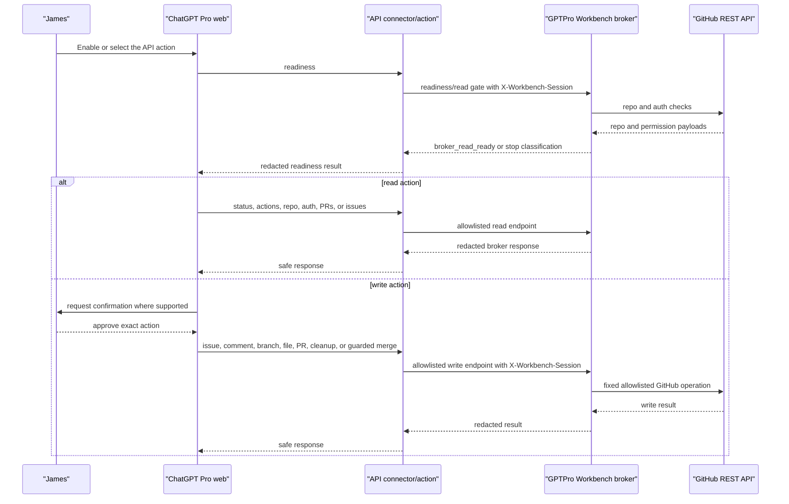
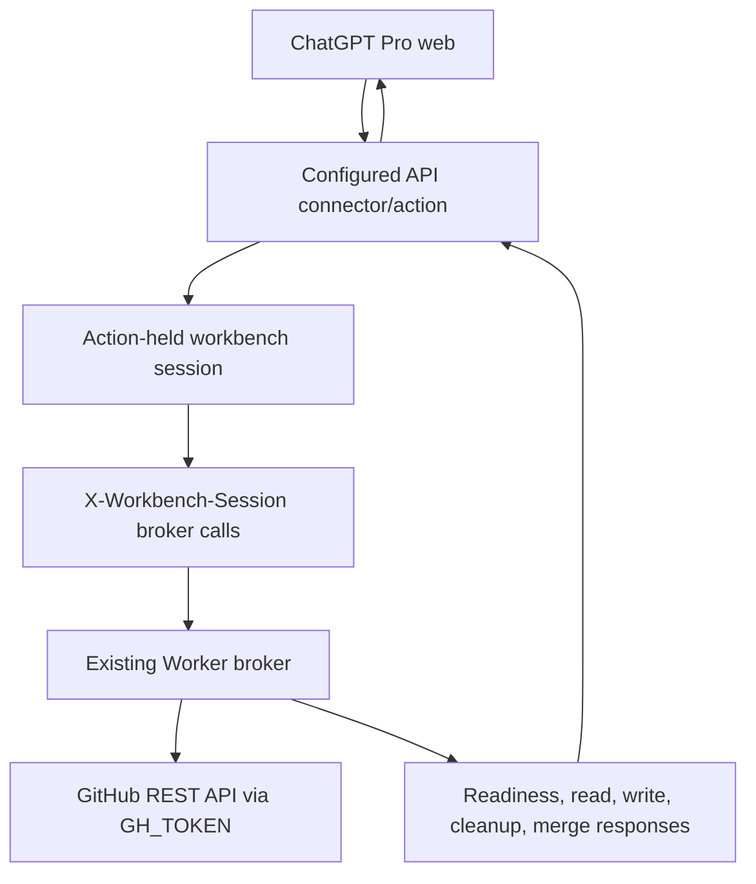

# feat: Expose Workbench as ChatGPT API Action

## Summary

Expose the existing GPTPro GitHub Workbench broker through a ChatGPT Pro web-visible API connector/action. The action should call hosted HTTP endpoints, hold the workbench session outside the model-visible prompt, and return only broker-controlled responses: readiness first, then allowlisted read/write GitHub operations through the existing Worker broker.

This revision deliberately corrects the previous planning drift. The target is not a shell/export workflow, not an MCP server, not a package installed into ChatGPT's environment, and not a new GitHub client. It is a hosted API action surface over the broker that ChatGPT can call.

---

## Problem Frame

The origin document is explicit that the current failure is a platform-boundary problem. A session URL exported on James's Mac, Codex, or another agent does not appear inside the ChatGPT runtime that needs authority. Shell DNS and shell environment variables are therefore the wrong boundary for reliable GitHub workbench access.

The broker design remains sound: it owns the GitHub token as a Worker secret, exposes narrow REST endpoints, validates repository/branch/path/merge rules, and has a probe contract that returns `broker_read_ready` only after read checks pass. The missing piece is an API connector/action that ChatGPT Pro web can invoke directly.

The connector/action should not expect to install libraries, CLIs, or plugins inside ChatGPT. All executable code lives in hosted infrastructure that already exists or is deployed with this project, such as the Cloudflare Worker broker or a minimal hosted adapter next to it.

---

## Assumptions

- The target integration is a ChatGPT Pro web-visible API connector/action, as described in the origin document.
- The action surface invokes hosted HTTP endpoints. It does not run package installation, shell commands, local Git, Node, Python, or repo-native tests inside ChatGPT's environment.
- The existing Worker broker remains the GitHub authority. Any adapter/action layer must call the broker or shared broker handlers, not implement a second broad GitHub client.
- The action holds or injects the signed workbench session through connector-side auth/configuration. ChatGPT should not see `GH_TOKEN` and should not need to see the signed session URL.
- `X-Workbench-Session` is the preferred action-to-broker session channel. Query string sessions remain available for manual debugging only.
- If the action platform requires registration metadata or a request/response schema, that metadata should mirror the fixed broker operations. It is not a new product architecture and should not introduce a generic API proxy.
- Write operations may require a ChatGPT-side confirmation step depending on the action surface, but broker-side validation remains the final safety boundary.
- The default target repository remains `fol2/ks2-mastery`; `fol2/gptpro-gh-workbench` remains allowlisted where the broker already supports it.

---

## Requirements

- R1. Provide a ChatGPT Pro web-visible API connector/action path that can be called from a normal ChatGPT conversation.
- R2. Do not depend on shell DNS, shared environment variables, local clone access, or package installation inside ChatGPT.
- R3. Keep GitHub authority inside the broker. ChatGPT must never receive `GH_TOKEN`, and the action layer must not become a broader GitHub API client.
- R4. Keep the signed workbench session out of ChatGPT-visible prompts, tool arguments, URLs, citations, logs, and screenshots where practical.
- R5. Add `X-Workbench-Session` support to the broker while retaining `?session=...` and cookie support for manual debugging.
- R6. Expose one readiness action equivalent to the probe read gate. It must return `broker_read_ready` only after status, actions, repository, and auth checks pass.
- R7. Expose read actions for status, actions, repository metadata, authenticated GitHub identity/permission, pull requests, and issues.
- R8. Expose write actions for issues, comments, `agent/...` branches, repository files on `agent/...` branches, pull requests, PR closure, branch deletion, and guarded PR merge.
- R9. Preserve strict write limits: no direct `main` writes, workflow edits, arbitrary Git refs, generic GitHub proxying, shell execution, secrets, settings, billing, or deployment endpoints.
- R10. Preserve merge rules: only open, non-draft `agent/...` pull requests from an allowlisted repository into that repository's `main`, squash merge only, explicit user approval for that exact PR, and `expectedHeadSha`.
- R11. Keep repo code access and GitHub interaction separate. Uploaded ZIP/git-bundle workflows are read-only fallbacks for code inspection, not substitutes for action-backed PR/issue operations.
- R12. Cover action contract, readiness classification, auth redaction, write safeguards, merge guardrails, and operating docs with repo-native tests.

---

## Scope Boundaries

- This plan does not create, request, rotate, or expose a GitHub token.
- This plan does not assume ChatGPT can install packages, run shell commands, export environment variables, clone GitHub, or resolve the broker host from a local runtime.
- This plan does not introduce an MCP server or MCP-specific tool adapter.
- This plan does not use the OpenAI API as the operating path. The operating path is ChatGPT Pro web invoking a configured API action.
- This plan does not make action registration metadata the source of truth. The source of truth remains the broker's allowlisted operations and tests.
- This plan does not create a generic REST relay, generic GitHub proxy, private executor, local test runner, or arbitrary command runner.
- This plan does not add default merge, deployment, repository administration, settings, secrets, billing, or workflow-management authority.
- This plan does not remove query/cookie session support; it keeps those paths for manual debugging while steering action calls to header/session-held auth.

### Deferred to Follow-Up Work

- Private executor integration for clone/fetch, local diffs, `npm test`, `npm run check`, and repo-native scripts behind a controlled broker boundary.
- Multi-user OAuth hardening if this becomes a team/workspace connector rather than a single trusted operator setup.
- Rich UI components or interactive app surfaces after the API action path proves readiness and write safety.
- Direct action registration in James's ChatGPT Pro account, because that depends on the live account UI and available connector settings.

---

## Context & Research

### Origin Document

- `docs/plan/ks2-github-access-achievement-plan.md` is the source of truth for this plan.
- The origin decision is to stop treating this as a shell/export problem and move broker access into a ChatGPT-visible API connector/tool plane.
- The origin target architecture is `ChatGPT assistant -> visible API connector/tool -> GPTPro Workbench broker -> GitHub repo`.
- The origin requires readiness first, with `classification == broker_read_ready`, before any writes.
- The origin specifically recommends `X-Workbench-Session` to avoid signed sessions in URLs.
- The origin keeps ZIP/git-bundle repository access as read-only fallback, not live GitHub authority.

### Relevant Code and Patterns

- `src/worker.js` is the current broker. It owns session gating, security headers, CORS, allowlisted read/write routing, GitHub REST calls, branch/path validation, cleanup endpoints, and guarded merge validation.
- `buildStatus()` and `buildActions()` already publish capability metadata that the action readiness response should reuse or mirror.
- `getSessionContext()` currently accepts query and cookie sessions; it is the natural seam for `X-Workbench-Session`.
- `tests/worker.test.js` uses Node's built-in test runner with mocked `fetch`, which is the right pattern for broker auth, readiness, and write-safety tests without live GitHub calls.
- `docs/ks2_workbench_broker_probe.py` and `tests/broker_probe_test.py` encode the desired read gate, write smoke, target-repo selector, cleanup flow, and guarded merge behaviour.
- `README.md` already lists the fixed read/write endpoints and should remain the concise operator-facing capability summary.
- `tests/workbench_docs.test.js` is the right place to keep documentation, endpoint lists, and secret-redaction claims from drifting.

### Institutional Learnings

- Keep capability layers separate: ChatGPT action visibility, action-held workbench session, Worker-held GitHub authority, and any future local executor are different boundaries.
- Do not guess at runtime reachability. A readiness result should state what was actually proven and stop on `broker_read_ready` failure.
- Deterministic fallback matters when tooling flakes: ZIP/git-bundle inspection can support planning and patch preparation, but it does not prove live GitHub write authority.
- Merge and cleanup must verify remote state directly because local multi-worktree state can disagree with GitHub after a successful merge or branch deletion.

---

## Key Technical Decisions

- Use a hosted API action over the existing Worker broker. This matches the origin document and James's clarification that the target is API connector/action, not an installable environment.
- Keep the action layer thin. It should expose fixed operations and call existing broker endpoints or shared broker handlers.
- Add `X-Workbench-Session` as the action-to-broker auth channel. Query/cookie sessions stay for humans and debugging.
- Make readiness a first-class action. The first call in every ChatGPT session must prove status, actions, repository, and auth before any write path is considered usable.
- Treat any action metadata/schema as registration glue only. It must not widen the broker contract or become a generic API proxy.
- Keep broker validation authoritative for write actions. ChatGPT-side confirmations are helpful UX but not the safety boundary.
- Keep the shell probe as a fallback/reference, not the primary ChatGPT Pro web path.

---

## Open Questions

### Resolved During Planning

- Is this a shell/export workflow? No. The original diagnosis says that boundary is wrong.
- Is this an MCP server plan? No. The target is API connector/action over hosted HTTP endpoints.
- Should ChatGPT install anything in its environment? No. The action calls hosted infrastructure.
- Should the action expose `GH_TOKEN`? No. The Worker secret remains broker-side only.
- Should the action expose the signed session URL to ChatGPT? No. The action should hold the session and call the broker using `X-Workbench-Session`.
- Should action writes bypass the read gate? No. Readiness must succeed first.
- Should merge be included? Yes, but only as guarded merge with explicit approval and `expectedHeadSha`.

### Deferred to Implementation

- Exact ChatGPT Pro action registration mechanics and UI wording.
- Where the signed session is stored for the action: action auth configuration, Worker secret, KV-backed session, or another connector-side secret store.
- Whether the action can call the existing broker endpoints directly, or whether the Worker should add action-friendly facade endpoints such as `/api/action/readiness`.
- Exact action operation names and descriptions as they appear in ChatGPT.
- Whether registration metadata can be maintained manually in docs or should be generated from the broker's operation descriptors.

---

## Output Structure

    src/
      worker.js
      actionOperations.js
    docs/
      chatgpt-workbench-action.md
      ks2_workbench_broker_probe.py
    tests/
      worker.test.js
      action_operations.test.js
      broker_probe_test.py
      workbench_docs.test.js

The tree is a target shape, not a mandate. If implementation can keep the action contract, broker routes, and docs aligned without a new `src/actionOperations.js` helper, prefer the smaller structure.

---

## High-Level Technical Design

> This diagram is directional guidance for review. It is not an implementation specification.

Action delivery modes:

| Mode | Role in this plan | Why |
|------|-------------------|-----|
| ChatGPT Pro API connector/action | Primary | Matches the origin target and James's clarification. |
| Existing Worker REST broker | Backend authority | Already holds `GH_TOKEN` and enforces repo/write/merge limits. |
| Minimal Worker action facade | Optional | Useful if ChatGPT action registration needs one readiness endpoint or cleaner operation paths. |
| Python shell probe | Fallback/reference | Useful only when same-runtime session and network reachability exist. |
| Uploaded ZIP/git-bundle | Read-only fallback | Supports inspection and patch preparation, not live PR/issue actions. |

---

## Implementation Units

- U1. **Define the API Action Contract and No-Install Runbook**

**Goal:** Establish the action contract as a ChatGPT Pro web-visible hosted API surface, with no dependency on installing anything inside ChatGPT.

**Requirements:** R1, R2, R3, R4, R6, R7, R8, R12

**Dependencies:** None

**Files:**
- Create: `docs/chatgpt-workbench-action.md`
- Modify: `README.md`
- Modify: `tests/workbench_docs.test.js`

**Approach:**
- Document the intended ChatGPT Pro setup in platform-neutral terms: ChatGPT invokes a configured API action; the action calls hosted broker endpoints.
- State explicitly that ChatGPT does not install packages, run shell commands, clone repositories, or receive environment variables.
- Define action operations and their broker mappings: readiness, status, actions, repo, auth, PRs, issues, issue create, comment create, branch create/delete, file write, PR create/close, and guarded merge.
- Document where secrets live: `GH_TOKEN` remains Worker-side; signed workbench session is action-side/broker-side; model-visible arguments contain neither.
- If action registration needs request/response metadata, document it as fixed operation metadata that mirrors broker tests.

**Patterns to follow:**
- `docs/plan/ks2-github-access-achievement-plan.md` for the runtime-boundary diagnosis and success criteria.
- `README.md` for concise capability and security-boundary language.
- `tests/workbench_docs.test.js` for documentation drift and secret-scan patterns.

**Test scenarios:**
- Happy path: docs identify the integration as ChatGPT Pro API connector/action, not shell/export or environment installation.
- Happy path: docs state that readiness is the first action and must return `broker_read_ready`.
- Happy path: docs list all fixed read/write operations and map them to broker endpoints.
- Error path: docs state that ChatGPT must stop when readiness is not `broker_read_ready`.
- Security path: docs contain no signed session URLs, raw `X-Workbench-Session` values, bearer tokens, cookie secrets, or GitHub token examples.

**Verification:**
- A future implementer can configure the action without trying to install code in ChatGPT or rebuild the broker as a different integration type.

---

- U2. **Add Broker Header Session Support**

**Goal:** Let action-to-broker calls authenticate without putting the signed workbench session in URLs.

**Requirements:** R3, R4, R5, R6, R12

**Dependencies:** U1

**Files:**
- Modify: `src/worker.js`
- Modify: `tests/worker.test.js`
- Modify: `docs/ks2_workbench_broker_probe.py`
- Modify: `tests/broker_probe_test.py`
- Modify: `README.md`

**Approach:**
- Extend `getSessionContext()` to accept `X-Workbench-Session` alongside existing query and cookie sessions.
- Keep query/cookie sessions intact for browser debugging and current probe compatibility.
- Allow the header only for the broker's safe API paths and expected preflight flow.
- Add optional probe support for header-session mode so operators can test the same action-to-broker boundary without printing session material.
- Redact the header anywhere request metadata, diagnostics, or docs might expose it.

**Execution note:** Characterise the existing query/cookie paths in tests before changing `getSessionContext()` so the manual debugging paths remain stable.

**Patterns to follow:**
- Existing session and unauthorised API tests in `tests/worker.test.js`.
- Existing redaction and URL-building tests in `tests/broker_probe_test.py`.

**Test scenarios:**
- Happy path: `X-Workbench-Session` authenticates `/api/status` without query parameters or cookies.
- Happy path: existing query and cookie sessions continue to authenticate dashboard/API paths.
- Happy path: preflight for safe API paths permits the header without broadening the CORS surface beyond the broker API.
- Error path: missing, malformed, or invalid header returns the same unauthorised shape before any GitHub call.
- Security path: response bodies, docs, and probe output do not echo the raw header value.

**Verification:**
- Hosted action calls can authenticate through a header while existing manual/debug paths continue to work.

---

- U3. **Expose a Readiness Action**

**Goal:** Provide a single action-readable readiness result equivalent to the probe's read gate.

**Requirements:** R1, R2, R3, R5, R6, R7, R12

**Dependencies:** U2

**Files:**
- Modify: `src/worker.js`
- Create or modify: `src/actionOperations.js`
- Modify: `tests/worker.test.js`
- Create or modify: `tests/action_operations.test.js`
- Modify: `docs/chatgpt-workbench-action.md`
- Modify: `README.md`

**Approach:**
- Prefer a hosted readiness endpoint or action operation that aggregates the existing read checks: `/api/status`, `/api/actions`, `/api/github/repo`, and `/api/github/auth`.
- Return a compact JSON shape with `ok`, `classification`, `target_repo`, `viewer`, `permission`, and action/capability summary.
- Return `broker_read_ready` only when all required read checks pass and the authenticated viewer has usable repository permission.
- Preserve the exact stop behaviour for missing session, invalid session, missing GitHub token, GitHub upstream failure, wrong repo, and insufficient permission.
- Keep readiness free of writes and free of session/token material.

**Patterns to follow:**
- `docs/ks2_workbench_broker_probe.py` read gate and `tests/broker_probe_test.py` expected classifications.
- `buildStatus()`, `buildActions()`, and `buildGitHubAuthStatus()` in `src/worker.js`.

**Test scenarios:**
- Happy path: readiness returns `classification: "broker_read_ready"` after status, actions, repo, and auth checks pass.
- Happy path: readiness supports the default repo and an allowlisted alternate repo where broker support already exists.
- Error path: missing or invalid session returns a stop classification and makes no GitHub write calls.
- Error path: missing `GH_TOKEN`, non-OK GitHub repo/auth responses, and insufficient repo permission do not return `broker_read_ready`.
- Security path: readiness output includes no raw session, GitHub token, bearer header, cookie, or upstream response headers.

**Verification:**
- ChatGPT has one safe first call that proves whether the broker is usable before any write action is attempted.

---

- U4. **Expose Fixed Read and Write API Actions**

**Goal:** Make the existing broker operations callable as fixed API actions without broadening authority.

**Requirements:** R1, R2, R3, R7, R8, R9, R12

**Dependencies:** U3

**Files:**
- Modify: `src/worker.js`
- Create or modify: `src/actionOperations.js`
- Modify: `tests/worker.test.js`
- Create or modify: `tests/action_operations.test.js`
- Modify: `docs/chatgpt-workbench-action.md`
- Modify: `tests/workbench_docs.test.js`

**Approach:**
- Define one fixed action operation per broker operation rather than a generic GitHub request action.
- Keep action inputs narrow: repository selector limited to the allowlist, branches validated as `agent/...`, file paths repository-relative, PR numbers positive integers, and merge requiring `expectedHeadSha`.
- Have action operations call the broker through `X-Workbench-Session` or shared broker handlers; do not call GitHub directly from the action layer.
- Return compact, redacted results so ChatGPT receives enough state to continue but no credentials or upstream headers.
- Keep any registration metadata aligned with `buildActions()` and the README endpoint list.

**Patterns to follow:**
- Existing endpoint list in `README.md`.
- Existing branch/path/repo validation in `src/worker.js`.
- Existing GitHub write tests in `tests/worker.test.js`.

**Test scenarios:**
- Happy path: read actions return status, actions, repo, auth, PRs, and issues for an allowlisted repository.
- Happy path: write actions map to the existing broker paths and preserve target-repo allowlisting.
- Edge case: alternate allowlisted repo is accepted where the broker already supports it.
- Error path: unknown repo, non-agent branch, workflow path, oversized content, invalid PR number, and missing required fields are rejected before GitHub calls.
- Security path: action definitions and action outputs do not expose `GH_TOKEN`, signed session URLs, action auth secrets, or raw upstream request headers.

**Verification:**
- ChatGPT-visible actions are a thin, fixed surface over the existing broker, not a second GitHub proxy.

---

- U5. **Preserve Write, Cleanup, and Merge Safeguards**

**Goal:** Ensure action-originated writes cannot exceed the existing broker's safety envelope.

**Requirements:** R3, R8, R9, R10, R12

**Dependencies:** U4

**Files:**
- Modify: `src/worker.js`
- Modify: `src/actionOperations.js`
- Modify: `tests/worker.test.js`
- Modify: `tests/action_operations.test.js`
- Modify: `docs/chatgpt-workbench-action.md`

**Approach:**
- Keep broker validation as the final authority for every action.
- Preserve cleanup limits: close PR by number only and delete validated `agent/...` branches only.
- Preserve merge limits: validate PR metadata before merge, require squash, reject stale `expectedHeadSha`, reject draft/closed/non-agent/forked/wrong-base PRs.
- Make merge approval wording concrete in docs: exact repository, PR number, source branch, target branch, current head SHA, and squash method.
- Keep error responses specific enough that ChatGPT can stop safely instead of retrying with broader permissions.

**Patterns to follow:**
- Existing `validateAgentBranch()`, `validateRepositoryPath()`, `validateMergeTarget()`, `mergePullRequest()`, and cleanup tests in `src/worker.js` and `tests/worker.test.js`.
- Existing probe write-smoke lifecycle for branch/file/PR/close/delete ordering.

**Test scenarios:**
- Happy path: issue/comment/branch/file/PR actions map to the existing broker endpoints and return redacted success payloads.
- Happy path: cleanup actions close the temporary PR before deleting the `agent/...` branch.
- Happy path: merge succeeds only for an open non-draft `agent/...` PR with a matching `expectedHeadSha`.
- Error path: `main`, non-agent branches, workflow paths, generic refs, unknown repos, and oversized bodies are rejected before GitHub calls.
- Error path: merge rejects missing/invalid `expectedHeadSha`, non-squash methods, draft PRs, closed PRs, wrong base, wrong repo, fork heads, and stale head SHA.
- Security path: action responses do not include raw session, `GH_TOKEN`, or full upstream headers.

**Verification:**
- A write-capable action session cannot do more than the existing broker was designed to allow.
- Merge remains a separate, approval-heavy operation rather than another generic write.

---

- U6. **Document Operation, Fallbacks, and Evidence**

**Goal:** Make the action usable and auditable by future agents without re-learning the runtime-boundary problem.

**Requirements:** R1, R2, R4, R6, R10, R11, R12

**Dependencies:** U1, U2, U3, U4, U5

**Files:**
- Modify: `README.md`
- Modify: `docs/chatgpt-workbench-action.md`
- Modify: `docs/ks2-rest-broker-test-report-2026-04-28.md`
- Modify: `docs/ks2-broker-retry-test-report-2026-04-28.md`
- Modify: `docs/ks2-broker-try-this-one-report-2026-04-28.md`
- Modify: `tests/workbench_docs.test.js`

**Approach:**
- Update README to state the primary path: ChatGPT Pro API action readiness first, then broker operations only if `broker_read_ready` is returned.
- Add a setup/runbook section covering action registration, connector-side session storage, first readiness test, write-smoke expectations, and guarded merge approval rules.
- Keep the shell probe documented as a fallback for runtimes that have both same-runtime session material and network reachability.
- Update evidence reports to distinguish confirmed broker capability, action contract readiness, live ChatGPT action registration status, and not-yet-connected private executor capability.
- Extend docs secret scans to include action docs and reject session query strings, header secrets, GitHub token prefixes, bearer secrets, and cookie secrets.
- Include a troubleshooting matrix for `missing_session`, `unauthorised_session`, `github_token_missing`, `github_upstream_failure`, write action unavailable, and `broker_read_ready` failure.

**Patterns to follow:**
- Existing README security-boundary language.
- Existing docs tests that scan for session and GitHub token material.
- The origin note's success criteria and strict merge rule.

**Test scenarios:**
- Happy path: docs name readiness as the first API action and include the expected success classification.
- Happy path: docs list all read/write actions and explicitly state that direct `main`, workflow, secrets, admin, shell, and generic proxy operations are absent.
- Error path: docs give stop guidance when readiness does not return `broker_read_ready`.
- Error path: docs separate read-only ZIP/git-bundle inspection from live action-backed GitHub operations.
- Security path: docs scans reject signed session URLs, concrete `X-Workbench-Session` values, GitHub token prefixes, bearer secrets, and cookie secrets.

**Verification:**
- A future establishing agent can configure and test the ChatGPT Pro API action without asking James for a GitHub token or trying another export-only workflow.

---

## System-Wide Impact

- **Interaction graph:** The change touches action registration, action-held session handling, broker session parsing, broker status/actions/read/write endpoints, and docs/tests.
- **Error propagation:** Readiness should preserve specific stop classifications so ChatGPT does not mistake missing session, missing `GH_TOKEN`, GitHub upstream failure, unavailable write actions, or target-repo rejection for a usable write path.
- **State lifecycle risks:** Write smoke and cleanup remain multi-step operations; partial failure must report PR number, branch, and manual cleanup need without hiding partial writes.
- **API surface parity:** Action operation metadata, broker status/actions, docs, and tests must describe the same operation set.
- **Integration coverage:** Unit tests should prove action-to-broker mapping and broker validation; live ChatGPT Pro action registration remains an operator smoke after deployment.
- **Unchanged invariants:** GitHub writes stay allowlisted, `agent/...` scoped, repository scoped, workflow-edit disabled, squash-only merge, and token-redacted. Query/cookie sessions remain available for manual debugging.

---

## Risks & Dependencies

| Risk | Mitigation |
|------|------------|
| The ChatGPT action setup cannot store or inject a hidden workbench session. | Use connector-side auth/configuration if available; otherwise add a minimal broker-side action facade that maps a separate action secret to the signed workbench session. |
| An implementer tries to install packages or run code in ChatGPT's environment. | Make no-install/no-shell a requirement and docs test assertion; all code lives in hosted Worker/adapter code. |
| Action metadata drifts from broker capabilities. | Centralise operation descriptors where practical and add tests that compare docs/action operations with broker-supported endpoints. |
| The action layer duplicates GitHub API calls and bypasses broker safeguards. | Keep the action as a thin HTTP facade over broker endpoints or shared broker handlers. |
| Signed session material leaks through action arguments, URLs, docs, or screenshots. | Store the session connector-side and use `X-Workbench-Session` only from action to broker; extend redaction and docs tests. |
| ChatGPT-side confirmation is mistaken for the only safety control. | Keep broker-side branch/path/repo/merge validation as final authority. |
| Partial cleanup leaves temporary branches or PRs. | Preserve self-cleaning write-smoke flow and return concrete manual cleanup identifiers on partial failure. |

---

## Documentation / Operational Notes

- The runbook should state the first action plainly: call readiness, continue only on `broker_read_ready`, and stop otherwise.
- The action setup guide should avoid signed session URLs in screenshots, citations, copied examples, or tool arguments.
- Deployment evidence should separate four states: broker deployed, action contract deployed, ChatGPT Pro action registered, and live action readiness proven.
- The shell probe remains useful for operators and regression testing, but it is not the primary ChatGPT Pro web path.
- Merge approval must remain concrete: exact repository, PR number, source branch, target branch, current head SHA, and squash method.

---

## Sources & References

- **Origin document:** [docs/plan/ks2-github-access-achievement-plan.md](../plan/ks2-github-access-achievement-plan.md)
- Related plan: [docs/plans/2026-04-28-002-feat-operable-broker-client-plan.md](2026-04-28-002-feat-operable-broker-client-plan.md)
- Related code: [src/worker.js](../../src/worker.js)
- Related tests: [tests/worker.test.js](../../tests/worker.test.js), [tests/broker_probe_test.py](../../tests/broker_probe_test.py), [tests/workbench_docs.test.js](../../tests/workbench_docs.test.js)
